# CREAMORA - Ice Cream & Dessert Cafe
CREAMORA adalah aplikasi kasir berbasis Android yang digunakan untuk membantu 
proses transaksi penjualan pada cafe ice cream dan dessert dengan 
tampilan modern, simple, dan mudah digunakan.

## Deskripsi Aplikasi
Kasir App adalah aplikasi kasir berbasis Android yang dibuat untuk mempermudah 
proses transaksi penjualan. Aplikasi ini memiliki fitur seperti menambahkan barang, 
menghitung total pembayaran secara otomatis, dan menyimpan data transaksi. 
Dengan tampilan yang sederhana dan mudah digunakan, aplikasi ini cocok digunakan sebagai 
media pembelajaran maupun sistem kasir sederhana untuk usaha kecil.

## Fitur Utama
- Dashboard Kasir
- Data Transaksi
- Data Pelanggan
- Data Tambah Pelanggan
- Data Laporan
- Data Akun
- Data Produk
- Data Tambah Produk
- Data Kategori
- Data Tambah Kategori
- Data Pegawai
- Data Tambah Pegawai
- Data Cabang
- Data Tambah Cabang
- Estimasi Pendapatan Harian
- Laporan Penjualan
- Printer Struk

## Teknologi Yang Digunakan
- Android Studio
- Kotlin
- XML Layout
- Firebase Realtime Database

## Tampilan Aplikasi

### Login
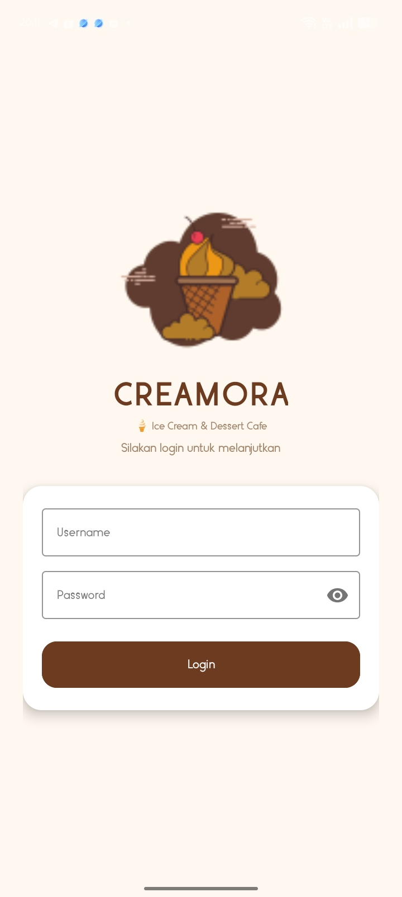

### Dashboard
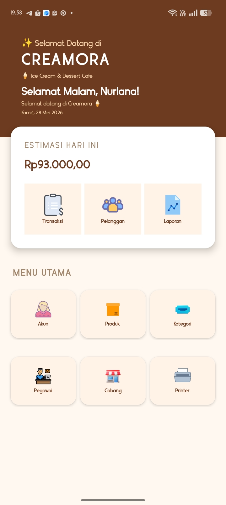

### Activity Transaksi
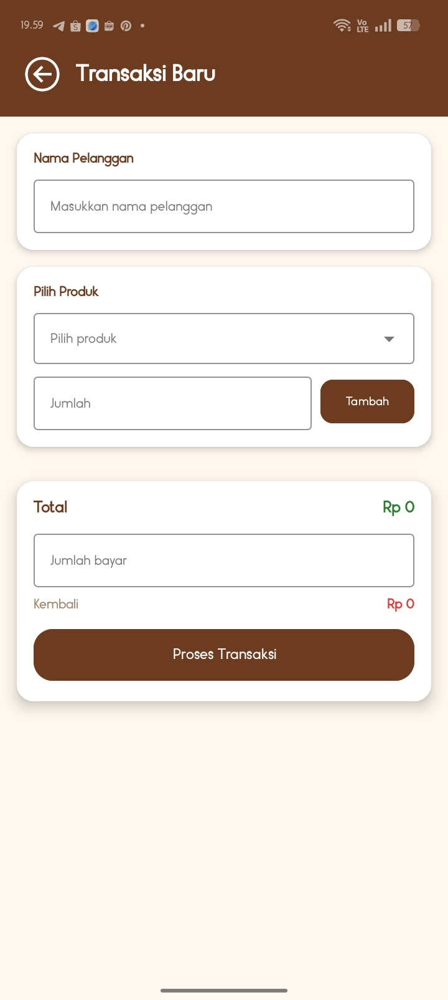
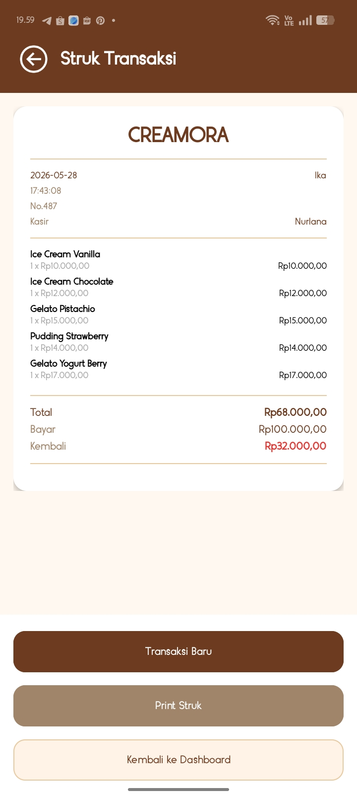

### Activity Pelanggan
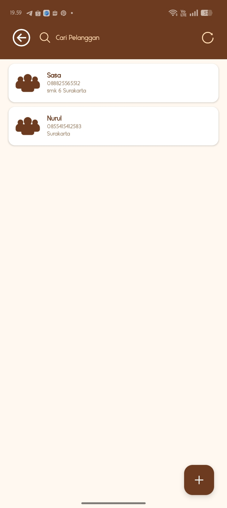
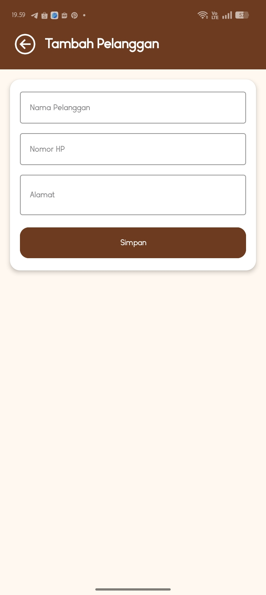

### Activity Laporan
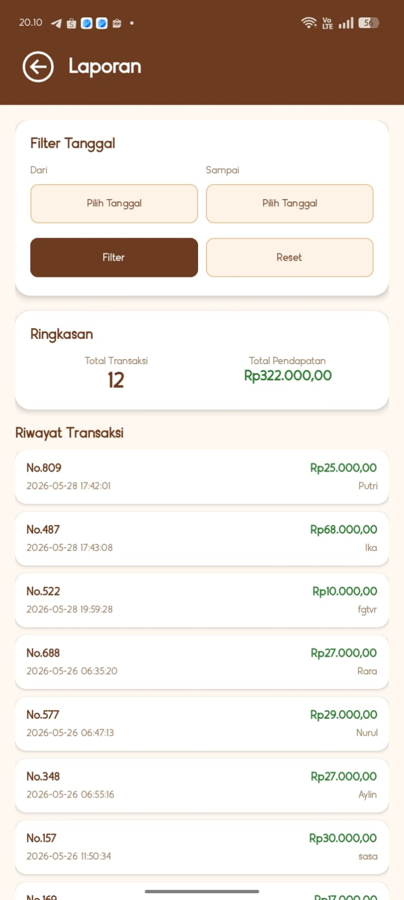

### Activity Akun
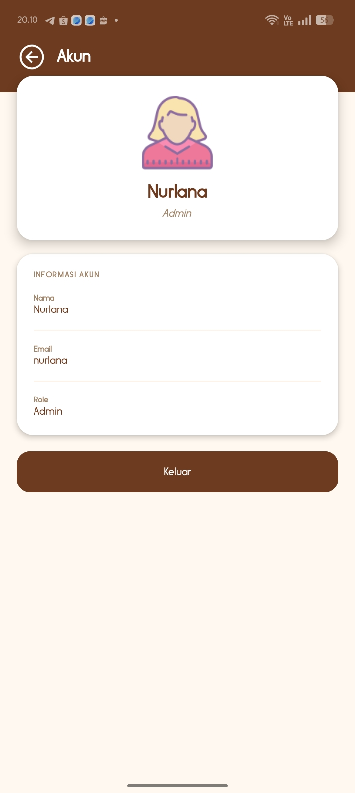

### Activity Produk
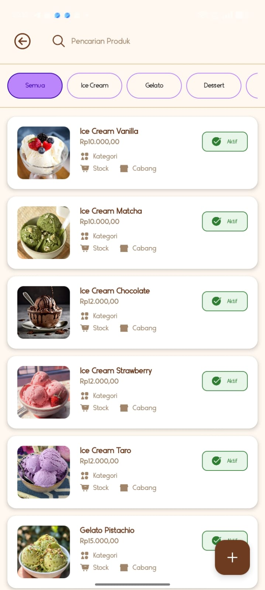
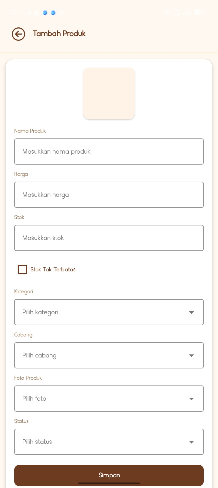

### Activity Kategori
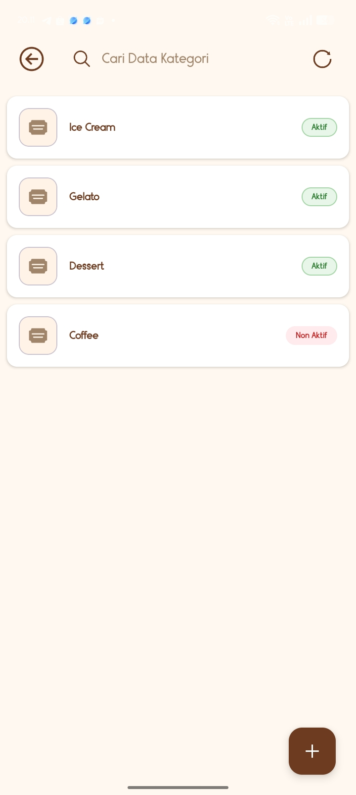


### Activity Pegawai
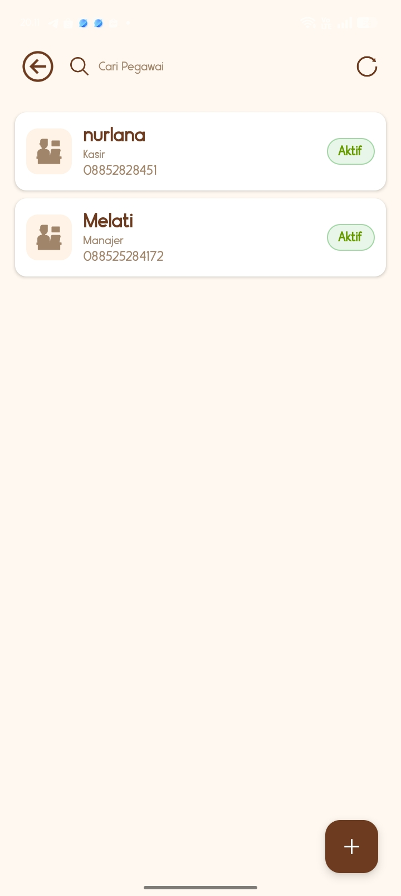
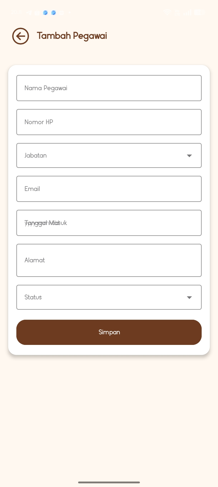

### Activity Cabang
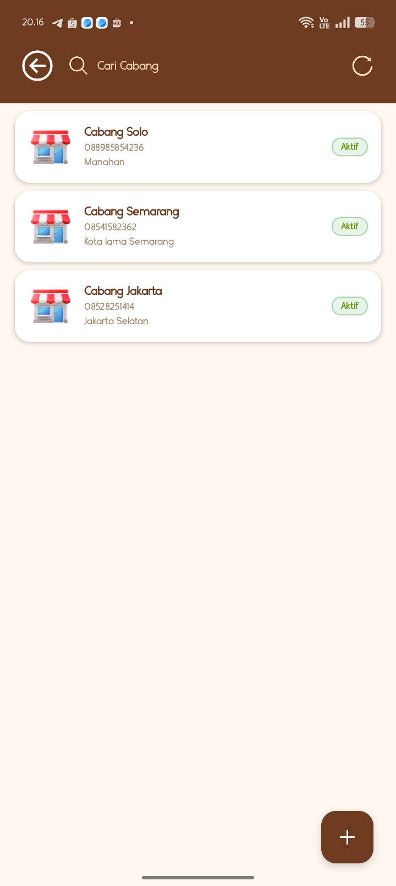
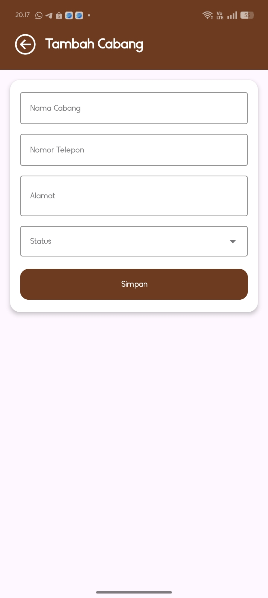

### Printer
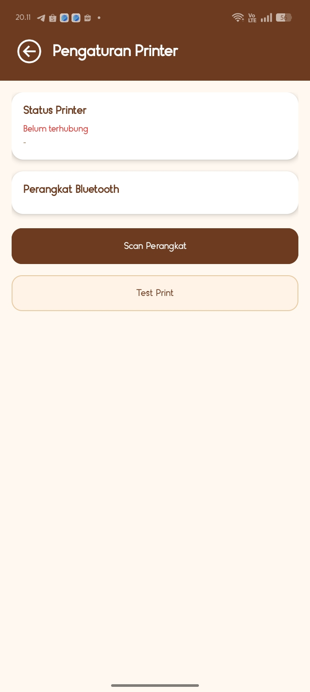

## Struktur Menu
- Dashboard
- Transaksi
- Pelanggan
- Laporan
- Akun
- Produk
- Kategori
- Pegawai
- Cabang
- Printer

## Cara Menjalankan Project
1. Clone repository
```bash
git clone https://github.com/nurlanaaaaa3/Kasir.git
```
2. Buka project menggunakan Android Studio
3. Tunggu proses Gradle selesai
4. Jalankan aplikasi menggunakan Emulator atau HP Android

## Kelebihan Aplikasi
Kelebihan dari Kasir App adalah tampilannya yang sederhana dan mudah digunakan 
sehingga pengguna dapat melakukan transaksi dengan lebih cepat dan lebih praktis. 
Aplikasi ini mampu menghitung total pembayaran secara otomatis, sehingga dapat mengurangi 
kesalahan perhitungan manual. Selain itu, data transaksi dapat disimpan dengan rapi sehingga 
memudahkan admin dalam melihat kembali riwayat penjualan. Aplikasi ini juga ringan 
dijalankan di perangkat Android dan dapat dikembangkan lagi dengan fitur 
tambahan sesuai kebutuhan pengguna.
